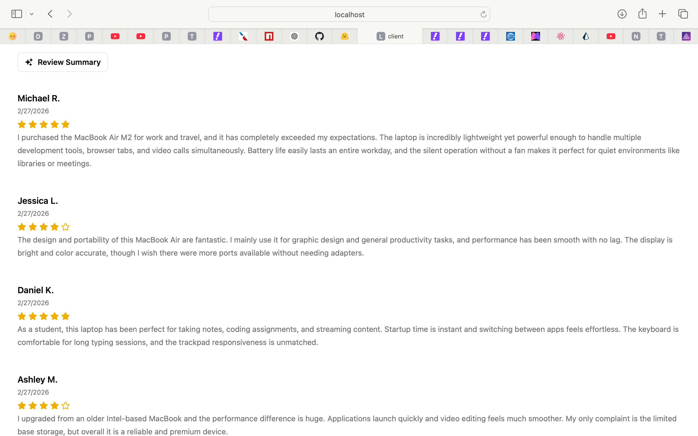
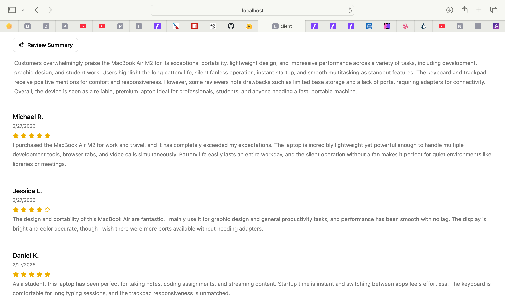
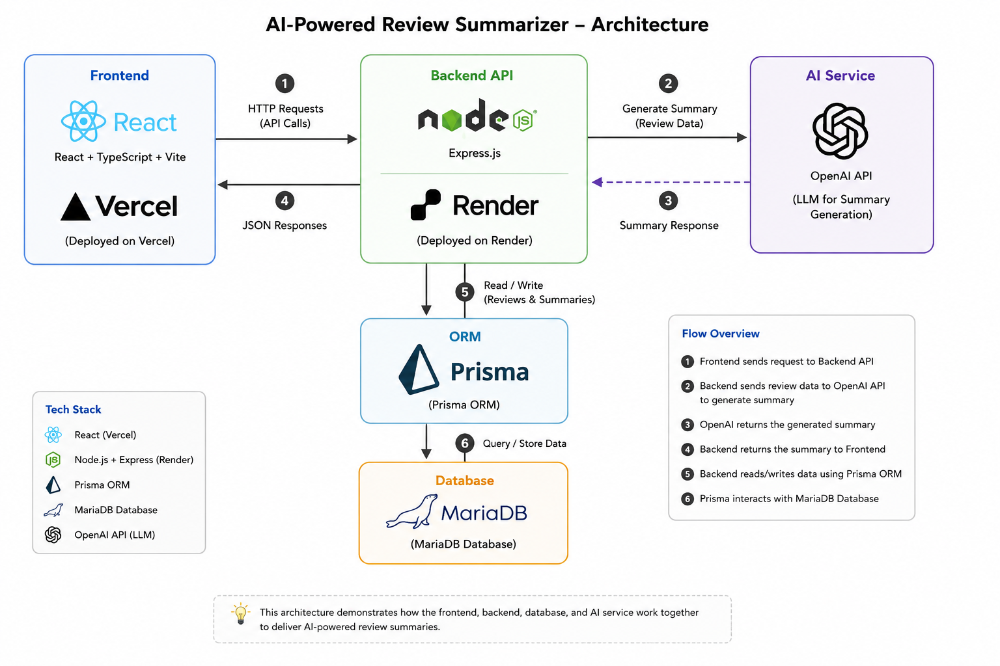

# AI Review Summarizer

A full-stack web application that summarizes customer product reviews using AI.

## Live Demo

https://my-first-app-one-opal.vercel.app/

## Features

- View customer reviews
- Generate AI-powered summaries
- Cached summaries for faster performance
- REST API backend
- Responsive frontend UI

## Tech Stack

### Frontend

- React
- TypeScript
- Vite
- Axios
- Tailwind CSS

### Backend

- Node.js
- Express.js
- Prisma ORM
- MySQL

### Deployment

- Vercel (Frontend)
- Render (Backend)

## Project Structure

```bash
packages/
  client/   # Frontend
  server/   # Backend
```

## Environment Variables

### Frontend

```env
VITE_API_URL=your_render_backend_url
```

### Backend

```env
DATABASE_URL=your_database_url
OPENAI_API_KEY=your_api_key
```

## Running Locally

### Install dependencies

```bash
npm install
```

### Start backend

```bash
cd packages/server
npm run dev
```

### Start frontend

```bash
cd packages/client
npm run dev
```

## Production Deployment

- Frontend deployed on Vercel
- Backend deployed on Render

## Screenshots

### Home Page



### Ai Summary Feature



### Architecture Diagram


